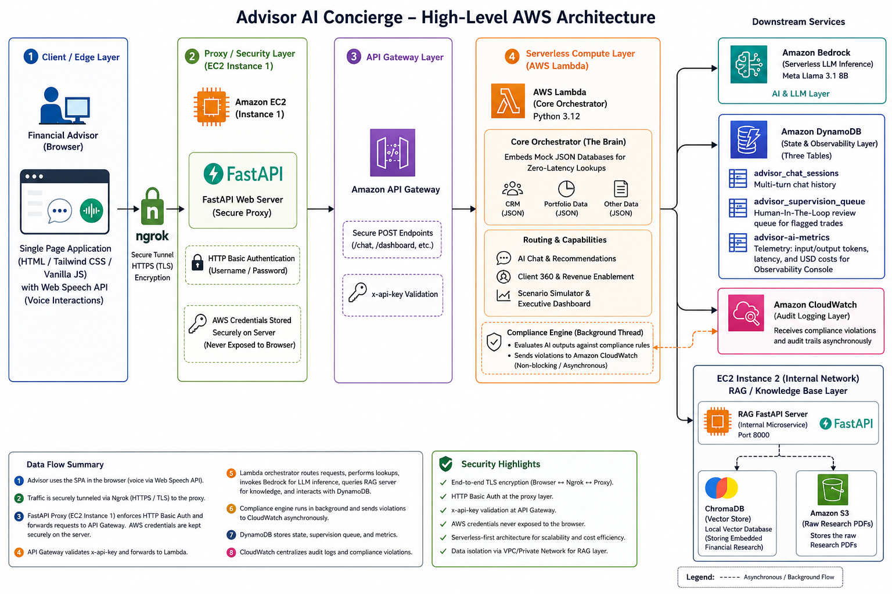

# 💼 Advisor AI — Intelligent Financial Concierge
### Built on AWS | Incedo University Mini Project | May 2026

---

## 🌐 Live Demo

```
URL:      https://strained-aletha-easeled.ngrok-free.dev
Username: <set via WEB_USERNAME env var — see .env.example>
Password: <set via WEB_PASSWORD env var — see .env.example>
```

> ⚠️ **Security Note:** Credentials are never committed to this repository. Set them via environment variables in your `.env` file. See `.env.example` for the template.

---

## 📋 Table of Contents

1. [Project Overview](#project-overview)
2. [Problem Statement](#problem-statement)
3. [Features Built](#features-built)
4. [Architecture](#architecture)
5. [Technology Decisions & Why](#technology-decisions--why)
6. [What Changed From Original Plan & Why](#what-changed-from-original-plan--why)
7. [AWS Services Used](#aws-services-used)
8. [Project Structure](#project-structure)
9. [Security Implementation](#security-implementation)
10. [How to Run Locally](#how-to-run-locally)
11. [Live Deployment Guide](#live-deployment-guide)
12. [Daily Operations](#daily-operations)
13. [Cost Summary](#cost-summary)
14. [API Reference](#api-reference)
15. [Documentation Index](#documentation-index)
16. [KPIs Addressed](#kpis-addressed)

> **Latest Features:** Feature 11 (Live Indian Market Data) and Feature 12 (Proactive Life-Event Alerts) were added in May 2026, directly addressing Sections 4.4 and 4.2 of the problem statement.

---

## Project Overview

Advisor AI is an **AI-powered financial advisor concierge** that allows financial advisors at broker-dealer firms to:

- Chat with their client portfolio data in natural language
- Search across financial research reports instantly using RAG
- Generate complete meeting preparation briefs in seconds
- Monitor compliance violations in real-time across all client portfolios
- Track AI observability metrics including tokens, cost, and latency
- Interact using voice input and auto-spoken responses
- Enforce human-in-the-loop supervision for high-risk AI recommendations
- **View live Indian market indices (Nifty 50, Sensex, Nifty Bank) updating every 5 minutes**
- **See proactive life-event alert cards for every client on the home dashboard**

Everything runs on AWS managed services with a professional glassmorphism web interface, secured behind HTTP Basic Authentication, and served over HTTPS via ngrok.

---

## Problem Statement

Financial advisors in broker-dealer firms operate in a highly fragmented ecosystem — client data, portfolios, research, compliance rules, and market insights are spread across multiple systems. This leads to:

- Delayed client responses
- Inefficient research and portfolio insights generation
- Inconsistent compliance adherence
- Missed revenue opportunities (cross-sell/upsell)
- High dependency on manual workflows

**Objective:** Build an AI-powered Advisor Concierge that acts as a real-time intelligent assistant to advisors — enhancing productivity, decision-making, and client engagement while ensuring compliance.

*Source: Incedo University Mini Project Problem Statement*

---

## Features Built

The application is split into two categories:

### 🏠 Advisor Tools (Daily Use)

---

### Feature 1 — Portfolio Chat
**Problem statement reference:** Section 4.1 (Advisor Productivity)

Advisors can ask natural language questions about their client portfolios and get instant, structured answers with specific numbers, risk flags, and actionable recommendations. Conversation memory is maintained across turns using DynamoDB.

**Example queries:**
- "Summarize my entire book performance today"
- "What are the top risks in Rahul's portfolio?"
- "Which clients need rebalancing?"

**AWS services:** Lambda, API Gateway, Bedrock (Llama 3.1), DynamoDB

---

### Feature 2 — RAG Research Search
**Problem statement reference:** Section 4.4, Section 5.3

Advisors can search across 5 financial research reports using natural language. The system retrieves relevant chunks from actual PDFs and generates grounded, cited answers — not hallucinations.

**Research reports indexed:**

| Report | Source |
|---|---|
| Semiconductor Sector Outlook 2025 | Goldman Sachs Research |
| Indian Banking Sector Q1 2025 | Morgan Stanley Research |
| Indian IT Sector Outlook FY2026 | JP Morgan Research |
| FMCG Sector Analysis India 2025 | UBS Research |
| India Macro Outlook 2025-2026 | Deutsche Bank Research |

**AWS services:** EC2 (t3.micro), S3, Bedrock (Llama 3.1), ChromaDB

---

### Feature 3 — Client 360 Meeting Prep
**Problem statement reference:** Section 4.1, Section 4.2 (Client Intelligence)

One click generates a complete meeting preparation brief containing:
1. Client Snapshot (age, AUM, risk profile, occupation)
2. Meeting Agenda (3 personalized talking points based on life events)
3. Portfolio Actions (specific rebalancing suggestions)
4. Cross-sell Opportunities (ranked by priority with reasoning)
5. Compliance Alerts (any flags to be aware of before the meeting)
6. Suggested Opening Line (personalized conversation starter)

**AWS services:** Lambda, API Gateway, Bedrock (Llama 3.1)

---

### Feature 4 — Compliance Monitor
**Problem statement reference:** Section 4.5, Section 5.5 (Governance & Risk Controls)

A real-time rule engine runs 6 automated compliance checks across all client portfolios. Every violation is logged to AWS CloudWatch for a complete, audit-ready trail.

**Compliance rules:**

| Rule | Check | Severity |
|---|---|---|
| Equity Concentration | Conservative client > 70% equity | 🔴 HIGH |
| Aggressive Overweight | Any client > 85% equity | 🟡 MEDIUM |
| Cash Drag | Cash allocation > 20% | 🟢 LOW |
| KYC Refresh Required | Pending compliance flags exist | 🔴 HIGH |
| Fixed Income Underweight | Conservative client < 40% fixed income | 🟡 MEDIUM |
| Large Single Day Loss | Equity day change < -3% | 🔴 HIGH |

**AWS services:** CloudWatch Logs, Lambda, DynamoDB

---

### Feature 6 — Voice Concierge
**Problem statement reference:** Section 5.1, Section 7.1

Enables advisors to interact with the system using natural speech — a truly hands-free experience.

- **Voice-to-Text:** Advisor clicks the mic icon and speaks. Voice is processed locally in the browser using the Web Speech API and submitted automatically to the AI backend.
- **Text-to-Voice:** When "Auto-Speak" is toggled on, the AI reads its response aloud in a professional voice.
- **Zero Cost:** Uses browser-native APIs — no AWS Polly or external TTS service needed.
- **Privacy:** Voice processing is local — only the final text reaches the AWS backend.

---

### 🛡️ Management & Risk (Back-Office)

---

### Feature 5 — AI Observability Console
**Problem statement reference:** Section 6.5 (Observability)

A real-time operational dashboard showing every Bedrock invocation's telemetry, directly from AWS.

**Metrics tracked per call:**
- Input tokens + Output tokens (from Bedrock response headers)
- Latency in milliseconds
- Cost in USD and INR ($0.22/1M tokens)
- Feature attribution (which tab triggered the call)

**Dashboard shows:**
- Total API calls since deployment
- Total tokens consumed
- Total cost in USD and INR
- Average latency per call
- Per-feature usage breakdown with progress bars
- Recent 10 invocations timeline

**AWS services:** DynamoDB (`advisor-ai-metrics`), Bedrock headers, Lambda, EC2 RAG server

---

### Feature 7 — Human-in-the-Loop Supervision Queue
**Problem statement reference:** Section 10 (Governance & Risk Controls — Human-in-the-Loop)

The most enterprise-grade feature. When the AI generates a recommendation that triggers a compliance violation, it does not warn — it **suspends** the advice entirely and routes it to a human supervisor for review.

**Workflow:**
1. AI generates a recommendation
2. Compliance engine detects a violation
3. Advice is **blocked** — advisor receives a Review ID instead
4. Flagged advice is saved to DynamoDB with `PENDING` status
5. Supervisor opens the Supervision Queue tab
6. Supervisor reads the AI rationale, types mandatory audit notes
7. Supervisor clicks **Approve** or **Override & Block**
8. Decision is permanently logged with timestamp and supervisor ID

**AWS services:** DynamoDB (`advisor-ai-supervision`), Lambda, FastAPI, CloudWatch

---

### Feature 8 — Portfolio Scenario Simulator
**Problem statement reference:** Section 4.3 (Scenario Simulations)

Advisors can run "What-If" analysis on any client portfolio by typing a natural language scenario. The AI engine calculates the hypothetical new allocation, estimates the impact on returns and risk, and shows a side-by-side comparison.

**Example scenarios:**
- "What if we move 20% from Equity to Fixed Income?"
- "Simulate a 10% market drop on Rahul's portfolio"
- "What if we increase Cash allocation to 15%?"

**Output includes:**
- Current vs. Simulated allocation (Equity, Fixed Income, Cash, Alternatives)
- Estimated Annual Return (before vs. after)
- Risk Level change (Low / Medium / High)
- AI rationale for the changes
- Compliance status of the simulated portfolio (PASS / WARNING / FAIL)

**AWS services:** Lambda, API Gateway, Bedrock (Llama 3.1)

---

### Feature 9 — Executive Dashboard (Advisor Command Center)
**Problem statement reference:** Section 12 (KPIs — Advisor Productivity)

The default home screen of the application. Aggregates data from all features into a single proactive view. The AI surfaces insights before the advisor asks anything.

**KPI cards shown on load:**
- Total Book AUM ($3.4M)
- Avg. YTD Return (13.7%)
- Compliance Health (live flag count)
- Active Clients (3)

**AI Proactive Recommendations:** Llama 3.1 scans the entire book and generates 3 daily insights (e.g., rebalancing needs, risk concentrations, client engagement triggers).

**Audit Feed:** A timeline of recent system activity (compliance checks, research indexing, session events).

**AWS services:** Lambda, API Gateway, Bedrock (Llama 3.1), DynamoDB

---

### Feature 10 — Revenue Enablement
**Problem statement reference:** Section 4.6 (Revenue Enablement)

A dedicated AI-powered tab that generates 4 ranked, personalized cross-sell and upsell product recommendations for each client. The AI draws from the client's real life events, financial goals, concerns, occupation, and portfolio to produce hyper-personalized advice.

**AWS services:** Lambda, API Gateway, Bedrock (Llama 3.1), DynamoDB

---

### Feature 11 — Live Indian Market Data
**Problem statement reference:** Section 4.4 (Conversational Search over Market Data), Section 5.2 (Unified Data Access Layer)

Real-time Indian stock market data is integrated at two levels — the dashboard and the AI chat — using the `yfinance` library with no paid API key required.

**Dashboard ticker (visual layer):**
- A glassmorphic `Indian Market Pulse` bar displays below the KPI cards on the Executive Dashboard
- Shows Nifty 50, Sensex, and Nifty Bank indices with live prices and colour-coded percentage changes (green = up, red = down)
- Blinking live status indicator (animated dot) confirms the feed is active
- Auto-refreshes every 5 minutes without any page reload

**Portfolio Chat context injection (AI layer):**
- When an advisor asks a market-related question (e.g. "What is the Nifty 50 today?"), the system intercepts the query
- Live prices are fetched from Yahoo Finance and injected into the Llama 3.1 prompt as a `[LIVE INDIAN MARKET DATA]` context block
- Llama responds with the actual, live index number and portfolio-specific recommendations based on the market movement
- Verified live response: *"The Nifty 50 is currently at 23,756.10, up 0.45%..."* with client-specific advice

**Example interaction:**
- Advisor asks: `"What is the current Nifty 50 level and how should I position my clients?"`
- AI responds with the actual live number + personalized advice for Priya, Rahul, and Anita

**API endpoint:** `GET /api/market`

**Tech:** `yfinance` (no API key), `fast_info.last_price`, `fast_info.previous_close`

---

### Feature 12 — Proactive Life-Event Alerts
**Problem statement reference:** Section 4.2 (Client Intelligence — Life-Event Detection)

The Executive Dashboard now surfaces **6 proactive, colour-coded alert cards** the moment the advisor logs in — without the advisor having to ask anything. This closes the Section 4.2 life-event detection requirement.

**What appears on the dashboard:**

| Severity | Client | Life Event | Advisor Action |
|---|---|---|---|
| 🔴 Danger | Anita Desai | Recently widowed | Immediate outreach: compliance check on account ownership change & capital preservation review |
| 🟡 Warning | Rahul Mehta | Recent startup liquidity event | Fresh capital deployment review: schedule ESOP & wealth accumulation advisory |
| 🟡 Warning | Rahul Mehta | Getting married in Dec 2025 | Prepare Wedding Fund SIP and schedule tax optimization review |
| 🔵 Info | Priya Sharma | Daughter starting college in 2026 | Review and reallocate Daughter Education Fund |
| 🔵 Info | Priya Sharma | Planning home purchase in 2027 | Assess mortgage suitability and structured equity withdrawal options |
| 🔵 Info | Anita Desai | Son settled abroad | Discuss NRI tax implications and update beneficiary designations |

**Severity levels:**
- 🔴 **Danger** — Immediate advisor action required (blinking red dot indicator)
- 🟡 **Warning** — High-priority upcoming event (amber border)
- 🔵 **Info** — Medium-term planning event (blue border)

**Sorted by urgency** — danger cards always appear first.

**API endpoint:** `GET /api/life-events`

**Data source:** `data/clients.json` — all life events sourced from CRM data, no hardcoding

---

## Architecture


```
Evaluator / Advisor Browser
        |
        v
https://strained-aletha-easeled.ngrok-free.dev  (HTTPS — permanent)
        |
        v
ngrok tunnel → EC2:8080
        |
        v
FastAPI Server (fast_app.py) ← HTTP Basic Auth
        |
        ├── /api/chat ──────────────→ API Gateway → Lambda → Bedrock (Llama 3.1)
        |                                                  ↕           ↕
        |                                           DynamoDB       Compliance Engine
        |                                           (sessions)     → Supervision Queue
        |
        ├── /api/rag ───────────────→ RAG Server (EC2:8000)
        |                                   ↕
        |                              ChromaDB (29 chunks)
        |                                   ↕
        |                         Bedrock (Llama 3.1) + Metrics → DynamoDB
        |
        ├── /api/client360 ──────────→ API Gateway → Lambda → Bedrock
        |                                                  ↕
        |                                        Supervision Queue (if flagged)
        |
        ├── /api/compliance ─────────→ Local Rule Engine → CloudWatch Logs
        |
        ├── /api/simulate ────────────→ API Gateway → Lambda → Bedrock (scenario engine)
        |
        ├── /api/dashboard ───────────→ API Gateway → Lambda → Bedrock (proactive insights)
        |                                                  ↕
        |                                           DynamoDB (book aggregation)
        |
        ├── /api/revenue ────────────→ API Gateway → Lambda → Bedrock (cross-sell engine)
        |                                                 ↕
        |                                    CLIENT_DATA + PORTFOLIO_DATA (dual lookup)
        |
        ├── /api/observability ───────→ DynamoDB scan → advisor-ai-metrics
        |
        ├── /api/supervision/pending ─→ DynamoDB scan → advisor-ai-supervision
        ├── /api/supervision/action ──→ DynamoDB update → CloudWatch audit log
        |
        ├── /api/market ─────────────→ yfinance (Yahoo Finance) → Nifty 50, Sensex, Nifty Bank
        |                               (no API key required — live prices every 5 min)
        |
        └── /api/life-events ─────────→ data/clients.json → structured alert payloads
                                        (6 events, severity-sorted: danger > warning > info)
```

---

## Technology Decisions & Why

### Why Llama 3.1 8B (not Claude)?

Claude on Bedrock requires an AWS Marketplace subscription which needs a credit card. We tested multiple models:

| Model Tested | Result | Reason Rejected |
|---|---|---|
| claude-3-haiku-20240307 | ❌ | Legacy, blocked after first call |
| claude-haiku-4-5-20251001 | ❌ | Marketplace subscription required |
| titan-text-express-v1 | ❌ | End of life, deprecated |
| titan-text-premier-v1 | ❌ | Not available in account |
| **llama3-1-8b-instruct-v1** | ✅ | Non-legacy, serverless, works immediately |

Llama 3.1 8B costs $0.22/1M tokens and produces high-quality financial advisory responses.

### Why FastAPI + HTML/CSS/JS (not Streamlit)?

The original plan used Streamlit. We switched because:
- Streamlit is rigid and looks basic — unsuitable for an executive demo
- Custom HTML/Tailwind CSS/Vanilla JS gives glassmorphism UI, animations, typing indicators
- FastAPI acts as a **secure proxy** — AWS API keys never exposed to the browser
- Addresses Section 5.6 (Security & Access Control) of the problem statement

### Why ChromaDB on EC2 (not Bedrock Knowledge Base)?

Bedrock Knowledge Base requires OpenSearch Serverless which costs **$350-700/month minimum** just to idle. ChromaDB on EC2 t3.micro provides identical RAG functionality at **$0 cost** (free tier).

### Why Browser Web Speech API (not AWS Polly)?

- AWS Polly costs $4/1M characters — adds real cost per demo
- Browser Web Speech API is free, zero latency, processes locally
- Voice never leaves the device — better privacy

### Why embed data in Lambda (not S3)?

Lambda reading from S3 on every request adds 200-400ms latency. Embedded JSON data loads instantly. S3 is used where it makes sense: storing the research PDFs.

### Why ngrok for HTTPS?

- AWS Certificate Manager + Load Balancer = $16/month
- ngrok free tier = $0, permanent static domain, instant HTTPS
- Gives a permanent URL that never changes — safe to share with evaluators

---

## What Changed From Original Plan & Why

| Original Plan | What We Built | Why It Changed |
|---|---|---|
| Claude 3.5 Haiku | Llama 3.1 8B | Claude needs marketplace subscription requiring credit card |
| Bedrock Knowledge Base + OpenSearch | ChromaDB on EC2 | OpenSearch costs $350-700/month, ChromaDB is free |
| Streamlit UI | HTML/Tailwind/JS + FastAPI | Streamlit too rigid, custom UI looks professional |
| Mock data in S3 | Embedded in Lambda | S3 reads add latency, embedded data is instant |
| HTTP on raw IP | HTTPS via ngrok | Security and professionalism for evaluator access |
| No auth | HTTP Basic Auth | Prevent unauthorized access to live demo |
| No voice | Browser Web Speech API | Section 5.1 explicitly requires voice interaction |
| Basic timestamps | IST Localization | All timestamps correctly localized to Indian Standard Time |
| Hardcoded sessions | Dynamic UUID Sessions | UUID generation allows multiple advisors to use the system simultaneously |
| Browser alert() dialogs | Toast Notification System | Replaced blocking alerts with animated glassmorphism toasts for premium UX |
| No observability | DynamoDB metrics + Dashboard | Section 6.5 requires AI model performance tracking |
| No human oversight | HITL Supervision Queue | Section 10 explicitly mandates human-in-the-loop |

---

## AWS Services Used

| Service | Purpose | Cost |
|---|---|---|
| Amazon Bedrock (Llama 3.1 8B) | LLM inference — all features | $0.22/1M tokens |
| AWS Lambda (Python 3.12) | Serverless compute — chat + client360 | Free tier |
| Amazon API Gateway | HTTPS endpoints with API key auth | Free tier |
| Amazon DynamoDB | Sessions + Metrics + Supervision tables | Free tier |
| Amazon EC2 (t3.micro) | RAG server + Web frontend + ngrok | Free tier |
| Amazon S3 | Stores 5 research PDFs | Free tier |
| AWS CloudWatch Logs | Compliance + supervision audit trail | Free tier |
| AWS IAM | Role-based access control | Free |
| **Total project cost** | | **~₹4 ($0.05)** |

---

## Project Structure

```
advisor-ai/                          # Local Mac project folder
├── static/                          # Frontend (HTML/CSS/JS)
│   ├── index.html                   # Main UI — glassmorphism SPA, 7 features
│   ├── styles.css                   # Custom CSS (animations, glass effect)
│   └── app.js                       # Vanilla JS — all feature interactions
│
├── data/                            # Mock data files
│   ├── portfolios.json              # 3 client portfolios with holdings
│   └── clients.json                 # CRM data (life events, goals, flags)
│
├── research_docs/                   # 5 financial research PDFs (also on S3)
│
├── fast_app.py                      # FastAPI server — secure proxy + auth
├── lambda_handler.py                # AWS Lambda — Feature 1, 3, 7
├── feature1_portfolio.py            # Portfolio chat local test runner
├── feature2_rag.py                  # RAG search local wrapper
├── feature3_client360.py            # Client 360 local test runner
├── feature4_compliance.py           # Compliance rule engine + CloudWatch
├── bedrock_client.py                # Local Bedrock wrapper (Llama format)
├── create_research_docs.py          # Script to generate research PDFs
├── requirements.txt                 # Python dependencies
├── .env.example                     # Environment variables template (safe to commit)
├── .env                             # Secrets — gitignored, never committed
├── .gitignore                       # Excludes .env, .pem, .venv, lambda.zip
│
├── tests/                           # Automated pytest suite (31 tests)
│   ├── test_advisor_ai.py           # Unit & integration tests for features
│   └── __init__.py
│
├── AdvisorAI_Feature1_Documentation.md
├── AdvisorAI_Feature2_Documentation.md
├── AdvisorAI_Feature3_Documentation.md
├── AdvisorAI_Feature4_Documentation.md
├── AdvisorAI_Feature5_Documentation.md
├── AdvisorAI_Feature6_Documentation.md
└── AdvisorAI_Feature7_Documentation.md

EC2 Instance (ip-172-31-43-64)
├── advisor-ai-rag/
│   ├── rag_server.py                # FastAPI RAG server (port 8000) + metrics
│   ├── research_docs/               # 5 PDFs downloaded from S3
│   └── chroma_db/                   # ChromaDB vector store (29 chunks)
│
├── Incedo_advisor_Ai/               # Web frontend (cloned from GitHub)
│   ├── static/                      # Frontend files
│   ├── fast_app.py                  # FastAPI web server (port 8080)
│   └── feature4_compliance.py       # Compliance engine
│
└── start_app.sh                     # One-command startup script
```

---

## Security Implementation

The application has 4 layers of security:

**Layer 1 — HTTPS (ngrok)**
All traffic is encrypted via TLS. No raw HTTP exposed to evaluators.

**Layer 2 — HTTP Basic Authentication (FastAPI)**
Every request requires username + password. Wrong credentials = 401 Unauthorized.

**Layer 3 — API Key Authentication (API Gateway)**
All Lambda endpoints require `x-api-key` header. The key lives only in server environment variables — never in browser code.

**Layer 4 — EC2 Security Groups**
Only ports 22 (SSH), 8000 (RAG internal), 8080 (Web) are open at the AWS network level.

**Additional practices:**
- `.env` file gitignored — credentials never committed to GitHub
- `.pem` key file stored on Desktop, gitignored
- FastAPI docs disabled (`docs_url=None`)
- MFA enabled on AWS root account
- IAM user used instead of root for all operations
- API throttling: 5 req/sec, 1000 req/month

---

## How to Run Locally

```bash
# 1. Clone the repository
git clone https://github.com/Prasukj7-arch/Incedo_advisor_Ai.git
cd Incedo_advisor_Ai

# 2. Create virtual environment
python3 -m venv .venv
source .venv/bin/activate

# 3. Install dependencies
pip install -r requirements.txt
# Includes: fastapi, uvicorn, requests, python-dotenv, boto3, yfinance, fpdf2, pypdf, chromadb

# 4. Create .env file
cp .env.example .env
# Then edit .env with your actual credentials — never commit this file

# 5. Run the Automated Test Suite
pytest tests/test_advisor_ai.py -v

# 6. Run the app
uvicorn fast_app:app --reload --port 8080

# 7. Open browser
open http://localhost:8080
# Login: use the credentials you set in your .env file
```

---

## Live Deployment Guide

The app runs on AWS EC2 (t3.micro, free tier) with ngrok providing HTTPS.

### start_app.sh (on EC2 home directory)

```bash
#!/bin/bash
export ADVISOR_AI_KEY=YOUR_API_KEY
export EC2_RAG_IP=localhost
export WEB_USERNAME=$WEB_USERNAME   # Load from secure environment / secrets manager
export WEB_PASSWORD=$WEB_PASSWORD   # Load from secure environment / secrets manager
cd /home/ec2-user/Incedo_advisor_Ai
git pull origin main
cd /home/ec2-user/advisor-ai-rag
pkill -f rag_server
nohup python3 rag_server.py > rag.log 2>&1 &
cd /home/ec2-user/Incedo_advisor_Ai
pkill -f fast_app
nohup python3 fast_app.py > web.log 2>&1 &
pkill -f ngrok
nohup ngrok http --domain=strained-aletha-easeled.ngrok-free.dev 8080 > ngrok.log 2>&1 &
echo "All services started!"
```

---

## Daily Operations

### 🌙 Shutdown (before sleeping) — run on Mac

```bash
# 1. Stop EC2
aws ec2 stop-instances \
  --instance-ids i-069a0fd9edb6c3897 \
  --region us-east-1

# 2. Delete API Gateway stage
aws apigateway delete-stage \
  --rest-api-id 6jg65j6ajh \
  --stage-name prod \
  --region us-east-1

# 3. Unlink usage plan
aws apigateway update-usage-plan \
  --usage-plan-id jyzpkv \
  --patch-operations '[{"op":"remove","path":"/apiStages","value":"6jg65j6ajh:prod"}]' \
  --region us-east-1
```

### ☀️ Startup (every morning) — run on Mac

```bash
# 1. Start EC2
aws ec2 start-instances \
  --instance-ids i-069a0fd9edb6c3897 \
  --region us-east-1

# 2. Wait 30 seconds, get new IP
aws ec2 describe-instances \
  --filters "Name=tag:Name,Values=advisor-ai-rag" \
  --query "Reservations[0].Instances[0].PublicIpAddress" \
  --output text --region us-east-1

# 3. SSH in and run startup script
ssh -i ~/Desktop/advisor-ai-key.pem ec2-user@NEW_IP
./start_app.sh
exit

# 4. Redeploy API Gateway
aws apigateway create-deployment \
  --rest-api-id 6jg65j6ajh \
  --stage-name prod \
  --region us-east-1

aws apigateway update-usage-plan \
  --usage-plan-id jyzpkv \
  --patch-operations '[{"op":"add","path":"/apiStages","value":"6jg65j6ajh:prod"}]' \
  --region us-east-1

# 5. Open the app
open https://strained-aletha-easeled.ngrok-free.dev
# Login: use the credentials you set in your .env file
```

---

## Cost Summary

| Service | Cost | Notes |
|---|---|---|
| EC2 t3.micro | $0 | Free tier — 750 hrs/month |
| Lambda | $0 | Free tier — 1M requests/month |
| API Gateway | $0 | Free tier — 1M calls/month |
| DynamoDB (3 tables) | $0 | Free tier — 25GB |
| S3 | $0 | Free tier — 5GB |
| CloudWatch | $0 | Free tier — 5GB logs |
| ngrok | $0 | Free tier — permanent static domain |
| Bedrock Llama 3.1 | ~$0.05 | All API calls for entire project |
| **TOTAL** | **~₹4** | **For the entire project** |

---

## API Reference

All endpoints require HTTP Basic Auth when called through FastAPI proxy.

### Portfolio Chat
```
POST /api/chat
Body: {"question": "Summarize my book today", "session_id": "session-001"}
Response: {"answer": "...", "session_id": "...", "turn": 1, "metrics": {...}}
```

### Research Search (RAG)
```
POST /api/rag
Body: {"question": "What are semiconductor top picks?"}
Response: {"answer": "...", "sources": ["goldman_sachs.pdf"]}
```

### Client 360 Meeting Prep
```
POST /api/client360
Body: {"client_name": "Rahul"}
Response: {"client_name": "Rahul Mehta", "aum": 2100000, "brief": "...", "status_code": "APPROVED"}
```

### Compliance Check
```
POST /api/compliance
Body: {"client_filter": null}
Response: {"summary": {...}, "results": [...]}
```

### AI Observability
```
GET /api/observability
Response: {"summary": {...}, "by_feature": {...}, "recent_calls": [...]}
```

### Supervision Queue — Fetch Pending
```
GET /api/supervision/pending
Response: [{review_id, client_name, feature, recommendation, violations, status}, ...]
```

### Supervision Queue — Take Action
```
POST /api/supervision/action
Body: {"review_id": "REV-xxx", "action": "APPROVE", "notes": "Supervisor notes here"}
Response: {"status": "success", "review_id": "REV-xxx"}
```

### Scenario Simulator
```
POST /api/simulate
Body: {"client_name": "Rahul", "scenario": "Move 20% from Equity to Fixed Income"}
Response: {"current": {...}, "simulated": {...}, "analysis": "...", "compliance_status": "PASS"}
```

### Executive Dashboard
```
GET /api/dashboard
Response: {"total_aum": "$3.4M", "avg_return": "13.7%", "client_count": 3, "insights": [...]}
```

### Revenue Enablement
```
POST /api/revenue
Body: {"client_name": "Priya"}
Response: {"client_name": "Priya Sharma", "aum": 800000, "risk_profile": "Moderate", "opportunities": [{"product": "...", "priority": "HIGH", "revenue_impact": "₹20 lakh / year", "rationale": "...", "compliance": "SUITABLE"}]}
```

### Live Market Data
```
GET /api/market
Response: {
  "indices": [
    {"name": "Nifty 50", "symbol": "^NSEI", "price": 23775.75, "change_pct": 0.54, "direction": "up", "fetched_at": "08:43 UTC"},
    {"name": "Sensex", "symbol": "^BSESN", "price": 75641.62, "change_pct": 0.61, "direction": "up", "fetched_at": "08:43 UTC"},
    {"name": "Nifty Bank", "symbol": "^NSEBANK", "price": 54059.65, "change_pct": 1.08, "direction": "up", "fetched_at": "08:43 UTC"}
  ]
}
```

### Proactive Life-Event Alerts
```
GET /api/life-events
Response: {
  "events": [
    {"client_id": "C003", "client_name": "Anita Desai", "event": "Recently widowed", "category": "Urgent Care", "severity": "danger", "action": "Immediate outreach: compliance check on account ownership change & capital preservation review."},
    {"client_id": "C002", "client_name": "Rahul Mehta",  "event": "Getting married in Dec 2025", "category": "Tax & Planning", "severity": "warning", "action": "Prepare Wedding Fund SIP and schedule tax optimization review."},
    ...
  ]
}
```

### System Status
```
GET /api/status
Response: {"api_gateway": "active", "ec2_rag": "active", "bedrock": "active"}
```

---

## Documentation Index

| Document | What it covers |
|---|---|
| `AdvisorAI_Feature1_Documentation.md` | Lambda setup, API Gateway, DynamoDB sessions, all CLI commands |
| `AdvisorAI_Feature2_Documentation.md` | S3 bucket, EC2 launch, ChromaDB, PDF ingestion, RAG pipeline |
| `AdvisorAI_Feature3_Documentation.md` | CRM data structure, Client 360 brief, meeting prep prompt engineering |
| `AdvisorAI_Feature4_Documentation.md` | 6 compliance rules, CloudWatch audit logging, FastAPI deployment |
| `AdvisorAI_Feature5_Documentation.md` | Bedrock telemetry, DynamoDB metrics table, observability dashboard |
| `AdvisorAI_Feature6_Documentation.md` | Web Speech API, voice-to-text, text-to-voice, Auto-Speak toggle |
| `AdvisorAI_Feature7_Documentation.md` | HITL workflow, supervision DynamoDB table, approve/override audit |
| `AdvisorAI_Feature8_Documentation.md` | Scenario simulator, What-If engine, side-by-side comparison, compliance check |
| `AdvisorAI_Feature9_Documentation.md` | Executive dashboard, KPI cards, proactive AI insights, audit feed |
| `AdvisorAI_Feature10_Documentation.md` | Revenue enablement, cross-sell engine, life-event personalization, 2×2 card UI |

---

## KPIs Addressed

From Section 12 of the problem statement:

| KPI | How Addressed |
|---|---|
| Advisor productivity improvement | Portfolio chat + Voice concierge reduces research time from hours to seconds |
| Reduction in client response time | Client 360 generates complete meeting brief in under 5 seconds |
| Compliance violations reduction | Real-time rule engine + HITL supervision catches violations before they reach clients |
| User adoption and engagement | Professional glassmorphism UI with voice, dark mode, and real-time status indicators |
| AUM / revenue per advisor | Cross-sell opportunities surfaced in every Client 360 brief |
| AI model performance tracking | Full observability console with cost, token, and latency metrics per feature |
| Portfolio scenario planning | Scenario Simulator allows instant what-if analysis before any client meeting |
| Proactive advisor intelligence | Executive Dashboard surfaces risks and opportunities before the advisor asks |
| Revenue per advisor | Revenue Enablement surfaces ₹ lakh-level cross-sell opportunities tied to real life events |
| **Live market data queries (Sec 4.4)** | **Advisor can ask "What is the Nifty 50 today?" — Llama responds with the actual live number + portfolio advice** |
| **Life-event detection (Sec 4.2)** | **6 colour-coded proactive alert cards on dashboard surface client life events with specific advisor actions** |

---

## Acknowledgements

Built as part of **Incedo University — Incedo 4.0 AI-First Vision**

Courses completed as part of this initiative:
- ✅ Prompt Engineering Practical Course (Udemy)
- ✅ AWS AI Practitioner Certification (AWS Skill Builder)
- ✅ Microsoft Copilot Training (Microsoft Learn)

---

*💼 Advisor AI | May 2026 | AWS Bedrock + Llama 3.1 + EC2 + Lambda + DynamoDB + ngrok*
